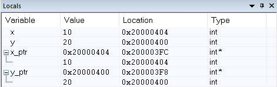
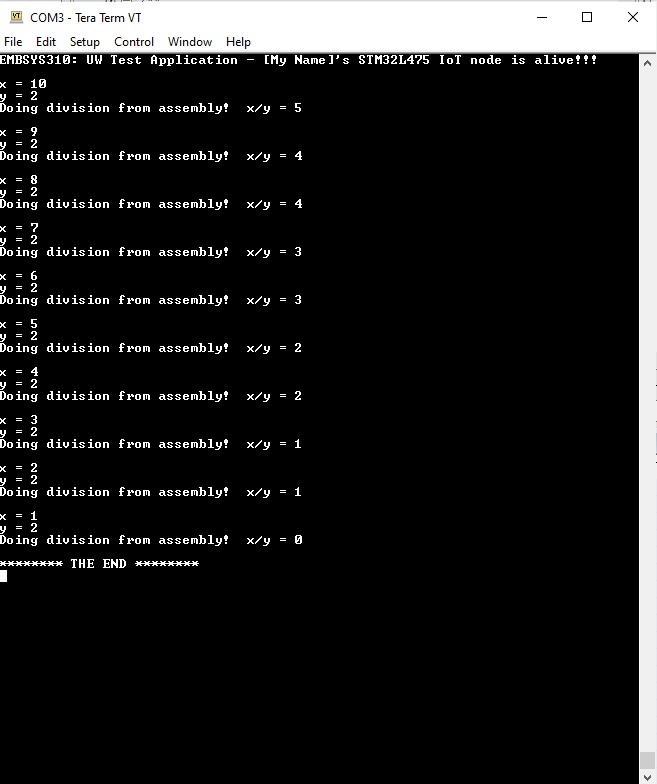

1a. main.c initializes the values x and y, that the pointers to swap are referencing. This way we aren't creating pointers with unknown content.
1b. the addresses of x and y are located in registers R0 and R1, respectively.
1c. 

2f. 
